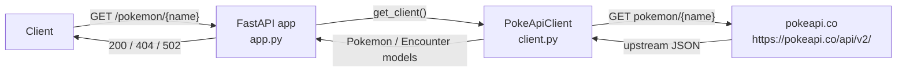

# Architecture

The wrapper is a thin translation layer between a client and PokeAPI. It holds no database and no cache. Each request arrives at FastAPI, the route asks `PokeApiClient` for the resource, the client fetches the upstream JSON, and it maps that JSON into the wrapper's own models before it returns.

The client is built once at startup in the FastAPI lifespan and stored on `app.state`. The routes receive it through the `get_client` dependency, so a test overrides that dependency instead of reaching the network. The upstream base URL is read from the `POKEAPI_BASE_URL` environment variable and defaults to the public API in `config.py`.

## Boundaries

- The HTTP request is the trust boundary. The path parameter is validated (letters, digits, and hyphens only) before the client runs.
- `PokeApiClient` is the only place that knows PokeAPI's payload shape. It maps to `Pokemon`, `PokemonType`, `Ability`, and `Encounter`.
- Upstream failures are translated at the boundary. A 404 becomes the wrapper's 404 and any other non-2xx, a connection error, or a non-JSON body becomes a 502.
- The container runs as a non-root user and exposes `GET /healthz` for the health check.

## Upstream contract

PokeAPI is a public, unauthenticated API. The client reads:

- `GET /api/v2/pokemon/{name}`, for `id`, `name`, `height`, `weight`, `types`, and `abilities`.
- `GET /api/v2/pokemon/{name}/encounters`, for the location areas and the versions.
